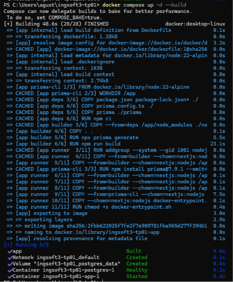
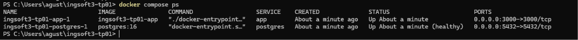
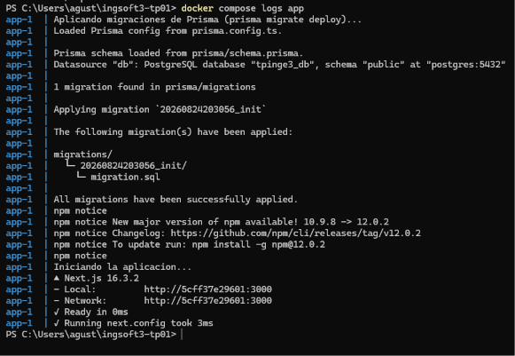
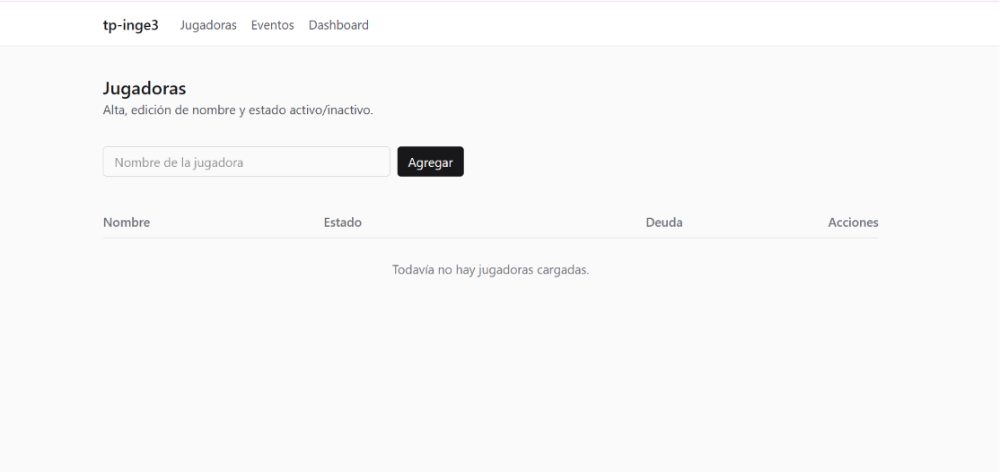
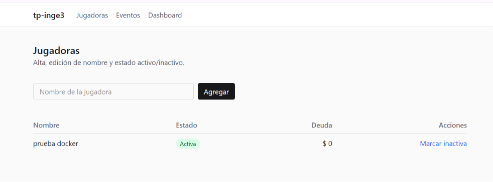
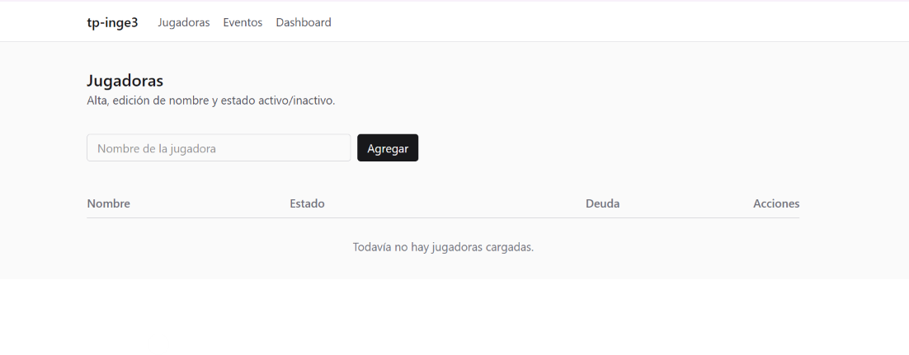
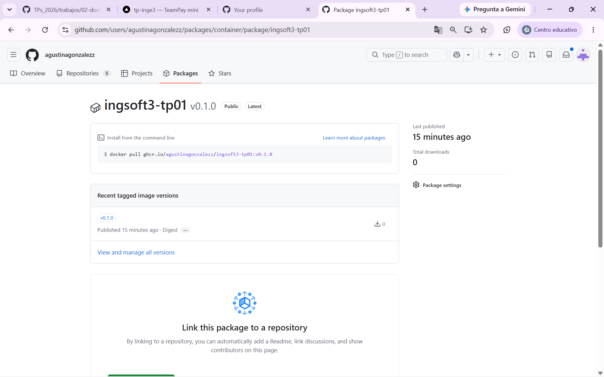
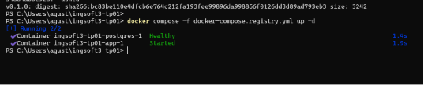

# Evidencias — TP1

## 1. Push directo a main rechazado
GitHub rechaza el push porque main está protegida y la regla alcanza también al dueño del repo.

## 2. El PR de la rama B no se puede mergear.
Hay un conflicto ya que se modifico el mismo archivo en la misma rama por dos personas distintas.

## 3. En el PR de la rama B
Muestro los conflictos entre ambas ramas (Ay B)

## 4. Relase publicado

## TP2 — Contenedores

Capturas de la app dockerizada funcionando de punta a punta.

### 1. Build de las imágenes

Captura de `docker compose up -d --build` corriendo sin errores.

### 2. Contenedores corriendo

Salida de `docker compose ps`: `postgres` healthy y `app` running.

### 3. Migraciones aplicadas al arrancar

Salida de `docker compose logs app`, mostrando la migración aplicándose
antes de que arranque el servidor de Next.

### 4. App funcionando

La app corriendo en `http://localhost:3000/jugadoras`, servida desde el
contenedor.

### 5. Persistencia de datos

**5a.** Se carga un dato de prueba desde la app.

**5b.** Después de `docker compose down` (sin `-v`) y `docker compose up -d`
de nuevo: el dato sigue ahí. El volumen `postgres_data` persiste los datos
aunque el contenedor se destruya y recree.

**5c.** Después de `docker compose down -v` (con `-v`) y `docker compose up -d`:
la tabla vuelve a estar vacía y las migraciones se re-aplican solas sobre el
volumen limpio.

### 6. Imágenes publicadas (ghcr.io)

Imagen publicada como pública en GitHub Container Registry, tag `v0.1.0`:
`ghcr.io/agustinagonzalezz/ingsoft3-tp01:v0.1.0`

### 7. Arranque desde las imágenes publicadas

`docker compose -f docker-compose.registry.yml up -d` levantando el sistema
completo descargando la imagen del registry, sin buildear local.

